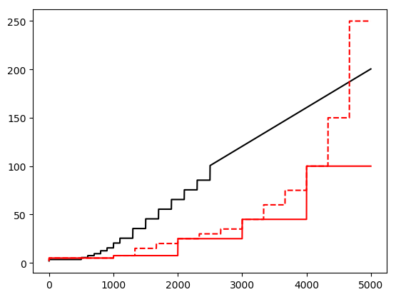

# parteien_beitrags_vergleich
Ein kleiner Vergleich der Mitgliedsbeiträge einiger deutschen Parteien

## Anmerkungen

### SPD
Die SPD teilt die Mitgliedsbeiträge in fünf Kategorien nach
Monatsnettoeinkommen auf. ab der zweiten Kategorie werden diese nochmal in
jeweils drei Beitragsstufen aufgeteilt, in die sich jedes Mitglied entsprechend
Einkommen einstuft. Diese Beitragsstufen sind im Graphen durch die gestrichelte
Line verdeutlicht.

## Quelle
Partei | Quelle | gültig seit
-------|--------|------------
DIE LINKE | [Beitragstabelle der Partei DIE LINKE](https://www.die-linke.de/fileadmin/download/grundsatzdokumente/beitragstabelle/die_linke_beitragstabelle_stand_januar_2016.pdf) | 01.01.2016
SPD | [Finanzordnung der Sozialdemokratischen Partei Deutschlands](https://www.spd.de/fileadmin/Dokumente/Parteiorganisation/Organisationsstatut.pdf) | 26.01.2016
